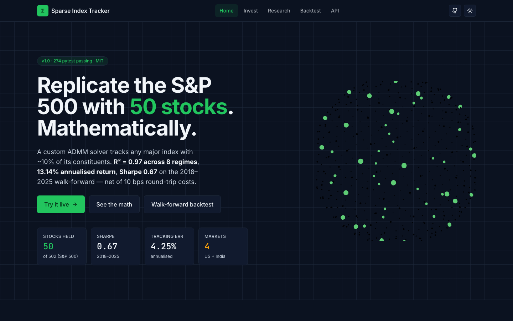
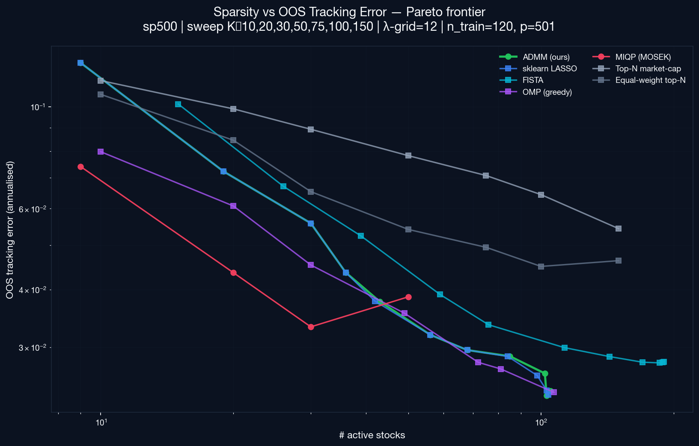
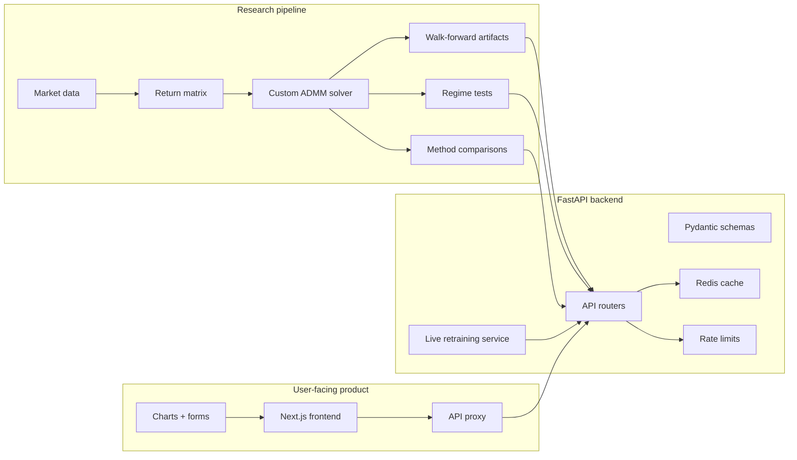
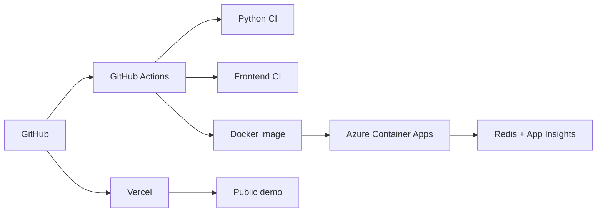
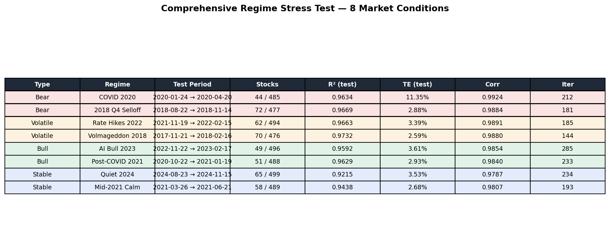

# Sparse Index Tracker

> Replicate the S&P 500, Nasdaq-100, Russell 2000, and Nifty 50 with roughly 10% of each index's constituents using a custom ADMM solver for sparse, L1-regularized portfolio optimization.

<p align="center">
  <b>Track the market. Hold the essence.</b>
  <br />
  A sparse index replication engine that compresses broad benchmarks into compact,
  tradable portfolios using a custom ADMM solver, real backtests, a FastAPI backend,
  and an interactive Next.js frontend.
</p>

<p align="center">
  <a href="https://sparse-index-tracker.vercel.app"><b>Launch Demo</b></a>
  |
  <a href="https://sparse-index-tracker.vercel.app/invest">Live Invest</a>
  |
  <a href="https://sparse-index-tracker.vercel.app/research">Research Lab</a>
  |
  <a href="https://sparse-index-tracker.vercel.app/backtest">Backtest Studio</a>
  |
  <a href="https://sparse-index-tracker.vercel.app/api">API Explorer</a>
</p>

<p align="center">
  <a href="https://github.com/PratyushGupta7/Sparse-Index-Tracker/actions/workflows/ci.yml">
    
  </a>
  <a href="https://github.com/PratyushGupta7/Sparse-Index-Tracker/actions/workflows/frontend-ci.yml">
    
  </a>
  <a href="https://github.com/PratyushGupta7/Sparse-Index-Tracker/blob/main/LICENSE">
    
  </a>
  
  
  
  
</p>

<br />

<p align="center">
  <a href="https://sparse-index-tracker.vercel.app">
    
  </a>
</p>

---

## What Is Sparse Index Tracking?

Most people think of index tracking as a solved problem: buy the whole index, or buy
an ETF that does it for you.

This project asks a harder question:

> How much of the market's behavior can we keep if we force the portfolio to become small?

Sparse Index Tracker learns a compact basket of stocks that tracks a broad benchmark
like the S&P 500. It does that with an L1-regularized optimization problem and a custom
Alternating Direction Method of Multipliers (ADMM) solver built specifically for sparse portfolio replication.

The result connects the pieces that usually stay separate: research pipeline, solver,
validation suite, API, cache, cloud deployment, and frontend.

*Keywords: sparse index tracking, index replication, ADMM solver, L1 regularization, LASSO portfolio, convex optimization, direct indexing, tax-loss harvesting, walk-forward backtesting, quantitative finance, FastAPI, Next.js.*

## What Problem This Solves

Broad index exposure is easy if you buy an ETF. It becomes harder when you want the
index behavior but also want control over the actual holdings.

Sparse tracking is useful when the question changes from:

```text
Can I buy the index?
```

to:

```text
Can I keep most of the index behavior while holding far fewer stocks?
```

That matters in several real settings:

| Problem | Why a sparse tracker helps |
| --- | --- |
| Too many names to trade | A 500-stock benchmark creates hundreds of orders, fills, corporate actions, and reconciliation events |
| Transaction-cost drag | Trading roughly 50-70 names instead of the full universe can reduce turnover mechanics and execution burden |
| Direct indexing | The investor owns individual stocks, so the portfolio can be customized rather than hidden inside an ETF wrapper |
| Tax-loss harvesting | Individual holdings make it possible to realize losses stock-by-stock while maintaining benchmark-like exposure |
| Custom exclusions | Stocks can be removed for ESG, compliance, liquidity, employer restrictions, or personal preference |
| Explainability | A 50-stock basket is easier to inspect than a 500-stock basket, especially for risk and attribution reviews |
| Research and teaching | The problem is a clean bridge between high-dimensional statistics, convex relaxation, and portfolio construction |

The mathematical reason this is non-trivial is that the return matrix is
high-dimensional. A typical training window might use `T = 120` trading days and
`N = 502` stocks, so there are more variables than observations. Directly searching
for the best 50-stock subset would require a combinatorial search over possible
stock baskets. The project replaces that hard subset search with an L1-regularized
convex relaxation that can be solved and validated repeatedly.

In practical terms, this project can be used as:

- a prototype for direct-indexing research,
- a benchmark-replication engine for constrained portfolios,
- a teaching example for L0-to-L1 relaxation and ADMM,
- a backend service that turns capital into share-level allocations,
- and a deployed demonstration of how quant research becomes an API and product.

The repository is designed to be read in layers:

| Entry point | What you will see |
| --- | --- |
| [Live Demo](https://sparse-index-tracker.vercel.app) | The deployed product and live endpoints |
| [Research Lab](https://sparse-index-tracker.vercel.app/research) | Regularization paths, convergence, and stress regimes |
| [`src/sit/solvers`](src/sit/solvers) | Custom ADMM solver and sparse optimization internals |
| [`src/sit/api`](src/sit/api) | FastAPI app, Pydantic v2 schemas, caching, and rate limits |
| [`frontend`](frontend) | Next.js 16 frontend with interactive charts, live forms, and API proxy |
| [`deploy`](deploy) | Docker, Azure Container Apps, and Redis deployment scripts |

---

## Try It In 30 Seconds

Open the product:

```text
https://sparse-index-tracker.vercel.app
```

Or hit the public frontend proxy:

```bash
curl https://sparse-index-tracker.vercel.app/api/proxy/api/v1/health
```

Try a live allocation:

```bash
curl "https://sparse-index-tracker.vercel.app/api/proxy/api/v1/invest_live?capital=10000&index=sp500"
```

That request travels through the Next.js app, reaches the FastAPI backend, retrains a
sparse model on recent market data, fetches live prices, and returns shares to buy.

---

## Results Snapshot

The project ships with benchmark artifacts and frontend-ready summaries from the
research pipeline.

| Metric | Current result | Meaning |
| --- | ---: | --- |
| Sparse S&P 500 basket | ~50 stocks | Tracks a 502-name universe with roughly 10% of constituents |
| Walk-forward R2 | ~0.97 | High explanatory fit across the 2018-2025 study |
| Annualized return | 13.14% | Walk-forward result after transaction-cost assumptions |
| Sharpe ratio | 0.67 | Risk-adjusted return over the validation window |
| Tracking error | 4.25% | Annualized benchmark-relative deviation |
| Regime tests | 8 | Includes COVID, Volmageddon, 2022 hikes, AI bull, quiet 2024 |
| Supported markets | 4 | S&P 500, Nasdaq-100, Russell 2000, Nifty 50 |
| Test suite | 274 pytest tests | Backend/research validation coverage |

The result is evaluated both numerically and operationally: solver agreement tests,
walk-forward validation, regime slices, API tests, and frontend build checks all sit
in the same repository.

<p align="center">
  
</p>

<p align="center">
  <sub>
    Sparsity is controlled by the regularization path. Moving along the curve trades
    a smaller portfolio for higher out-of-sample tracking error.
  </sub>
</p>

---

## Product Tour

| Route | Purpose | Why it exists |
| --- | --- | --- |
| [`/`](https://sparse-index-tracker.vercel.app) | Landing page | Communicates the thesis, metrics, and architecture quickly |
| [`/invest`](https://sparse-index-tracker.vercel.app/invest) | Live ADMM retrain | Converts capital + index into a sparse share allocation |
| [`/research`](https://sparse-index-tracker.vercel.app/research) | Research lab | Shows sparsity trade-offs, convergence, and regime behavior |
| [`/backtest`](https://sparse-index-tracker.vercel.app/backtest) | Backtest studio | Displays walk-forward curves, risk metrics, and comparisons |
| [`/api`](https://sparse-index-tracker.vercel.app/api) | API explorer | Lets visitors inspect and call the backend through the frontend proxy |

---

## The System At A Glance



Deployment path:



---

## Mathematical Core

Let `X` be a matrix of constituent returns with shape `T x N`, where `T` is the
number of training days and `N` is the number of stocks in the universe. Let `y` be
the benchmark return vector over the same dates. The goal is to learn weights `w`
so that `Xw` behaves like `y`, while most entries of `w` become zero.

The base problem is the long-only sparse tracking objective:

$$
\min_{w \ge 0} \; \frac{1}{2}\lVert Xw - y \rVert_2^2 + λ \lVert w \rVert_1
$$

After convergence, the positive weights are normalized back onto the fully invested
simplex so they can be interpreted as portfolio weights:

$$
w_i \ge 0, \qquad \sum_i w_i = 1
$$

In plain language:

- match the benchmark return stream,
- penalize portfolios that need too many names,
- keep the final allocation long-only,
- and return weights that can be converted into actual share counts.

### Why L1 Creates Sparsity

The L1 term $λ \lVert w \rVert_1$ adds a cost for keeping weights alive. As `λ`
increases, small marginal positions are pushed to exactly zero. This creates a
regularization path:

```text
low λ  -> more stocks, lower tracking error
high λ -> fewer stocks, higher tracking error
```

The Pareto plot above is the practical version of that statement: it shows how many
active stocks the model keeps at different regularization strengths and what that
does to out-of-sample tracking error.

### Why ADMM Fits The Problem

ADMM is a natural fit because it splits the problem into pieces that are easier to
solve. The implementation introduces an auxiliary variable `z` and enforces `w = z`:

$$
\min_{w,z} \; \frac{1}{2}\lVert Xw - y \rVert_2^2 + λ \lVert z \rVert_1 + I(z \ge 0)
\quad \text{subject to} \quad w - z = 0
$$

This gives three interpretable update steps:

| ADMM component | Role in this project |
| --- | --- |
| `w` update | Solves a ridge-like least-squares system |
| `z` update | Applies positive soft-thresholding, which creates sparsity |
| `u` update | Updates the scaled dual variable so `w` and `z` agree |
| Adaptive rho | Rebalances primal and dual progress across different data scales |
| Residual checks | Stops only when primal and dual feasibility are both small |

The expensive matrix solve is stabilized with a Cholesky factorization of
`X'X + rho I`. When `rho` changes, the factorization is recomputed; otherwise the
cached factor is reused.

### How The Math Was Checked

The mathematical implementation is tested from several angles:

| Check | What it verifies |
| --- | --- |
| Synthetic sparse recovery | On controlled problems, the recovered support and weights match the planted sparse portfolio |
| Lambda-max behavior | Above `lambda_max`, the solver correctly collapses to the zero solution before normalization |
| Objective trajectory | The recorded objective ends below its starting value |
| CVXPY agreement | ADMM and CVXPY solve the same convex objective to nearly the same minimizer |
| LASSO agreement | The sklearn LASSO baseline agrees with ADMM after matching the lambda scaling |
| Simplex checks | Returned portfolio weights are non-negative and normalized |
| Walk-forward tests | Rebalanced weights remain valid through the historical simulation |
| Regime tests | Performance is sliced across distinct market conditions rather than only one full-sample number |

The solver is therefore checked at the mathematical level, the backtest level, and
the API/product level.

### Robustness Across Regimes

A single full-period backtest can hide where a model is fragile. The regime test
breaks the validation into distinct market environments: crashes, rate-hike stress,
volatile periods, bull markets, and calmer windows. This matters because sparse
portfolios can look good in one smooth trend and fail when correlations shift.

The table below is a useful result because the model keeps high test-set `R2` and
correlation across very different market conditions while using only a small subset
of the full universe in each window. It does not prove future performance, but it
does show that the method is not only fitting one easy sample.

<p align="center">
  
</p>

---

## Why a Custom ADMM Solver Instead of CVXPY?

CVXPY is excellent for modeling. This project still uses solver baselines for
comparison, but implements a custom ADMM path so the optimization steps, convergence
diagnostics, and live retraining behavior are visible in the codebase.

That gives the project:

- direct control over iterations and stopping criteria,
- faster repeated solves for path and backtest workflows,
- transparent convergence diagnostics,
- easier integration with live retraining,
- and a solver that can be explained from math to code to product.

---

## API Surface

The backend is intentionally open for the public demo, protected with `slowapi` rate
limits and environment-driven CORS. The frontend calls it through a proxy route so the
public website has a clean surface.

Core endpoints:

| Endpoint | Description |
| --- | --- |
| `GET /api/v1/health` | Backend health and loaded solver summary |
| `GET /api/v1/portfolio?index=sp500` | Pre-baked sparse weights where available |
| `GET /api/v1/invest?capital=10000&index=sp500` | Allocate capital to cached sparse weights |
| `GET /api/v1/invest_live?capital=10000&index=sp500` | Retrain on recent data and return share counts |
| `GET /api/v1/backtest/walkforward` | Walk-forward equity curves and metrics |
| `GET /api/v1/methods/comparison` | Baseline comparison panel |
| `GET /api/v1/markets/cross-index` | Cross-market results |
| `GET /api/v1/cvxpy-speedup` | ADMM vs CVXPY benchmark artifact |
| `GET /api/v1/lambda-path?index=sp500` | Regularization path for the frontend slider |
| `GET /api/v1/regimes` | Eight-regime stress-test summary |

Public proxy examples:

```bash
curl https://sparse-index-tracker.vercel.app/api/proxy/api/v1/health
curl "https://sparse-index-tracker.vercel.app/api/proxy/api/v1/portfolio?index=sp500"
curl "https://sparse-index-tracker.vercel.app/api/proxy/api/v1/lambda-path?index=sp500"
```

---

## How The System Is Packaged

The repository keeps research, API, frontend, and deployment pieces together so each
claim can be traced to code or an artifact.

| Layer | What is included |
| --- | --- |
| Research | Walk-forward validation, regime tests, benchmark artifacts, method comparison |
| Solver | Custom ADMM, adaptive rho, sparse thresholding, residual diagnostics |
| API | FastAPI routers, Pydantic v2 schemas, rate limits, Redis caching |
| Frontend | Next.js 16, TypeScript, Tailwind, charts, live forms, Vercel deployment |
| Cloud | Docker, Azure Container Apps, Azure Cache for Redis, App Insights |
| CI | Python lint/type/test workflow and frontend type/lint/build workflow |

---

## Repository Map

```text
.
|-- app.py                         # FastAPI compatibility entrypoint
|-- src/sit/
|   |-- api/                       # FastAPI app, routers, schemas, services
|   |-- solvers/                   # Custom ADMM solver
|   |-- data/                      # Universe and data loading utilities
|   |-- backtest/                  # Walk-forward validation logic
|   `-- regimes/                   # Regime stress testing
|-- benchmarks/                    # CVXPY, method comparison, frontend export scripts
|-- tests/                         # Pytest suite
|-- frontend/                      # Next.js product frontend
|-- deploy/                        # Dockerfile and Azure deployment scripts
|-- docker-compose.yml             # Local API + Redis stack
`-- README.md
```

Files worth reading first:

| File or directory | Why it matters |
| --- | --- |
| [`src/sit/solvers`](src/sit/solvers) | Numerical core of the project |
| [`src/sit/api/main.py`](src/sit/api/main.py) | FastAPI setup, middleware, router mounting, telemetry hooks |
| [`src/sit/api/routers`](src/sit/api/routers) | Public API endpoints |
| [`src/sit/api/services/retraining.py`](src/sit/api/services/retraining.py) | Live retraining path used by `/invest_live` |
| [`benchmarks`](benchmarks) | Experiment and frontend artifact generation scripts |
| [`frontend/src/app`](frontend/src/app) | Product pages and API proxy |
| [`deploy/Dockerfile`](deploy/Dockerfile) | Production API container |

---

## Supported Markets

| Universe | Status | Notes |
| --- | --- | --- |
| S&P 500 | Pre-baked + live | Main demonstration universe |
| Nasdaq-100 | Live | Supported through live retraining |
| Russell 2000 | Live with cap | Public-demo universe cap avoids data-provider overload |
| Nifty 50 | Live | Includes fallback handling for upstream data issues |

---

## Run Locally

### Backend

Use Python 3.11.

```bash
git clone https://github.com/PratyushGupta7/Sparse-Index-Tracker.git
cd Sparse-Index-Tracker

python3.11 -m venv .venv
source .venv/bin/activate
pip install --upgrade pip setuptools wheel
pip install -r requirements.txt
pip install -r requirements-dev.txt
pip install -e .

uvicorn app:app --host 0.0.0.0 --port 8000 --reload
```

Open:

```text
http://localhost:8000/docs
```

### Frontend

```bash
cd frontend
pnpm install
NEXT_PUBLIC_API_URL=http://localhost:8000 pnpm dev
```

Open:

```text
http://localhost:3000
```

### Docker

```bash
docker compose up --build
```

That starts the API and Redis together.

---

## Verification

Backend:

```bash
make lint
make test-fast
```

Frontend:

```bash
cd frontend
pnpm type-check
pnpm lint
pnpm build
```

Docker smoke test:

```bash
make docker-build
make docker-up
make docker-smoke
```

---

## Deployment

The live system is deployed as:

| Component | Platform |
| --- | --- |
| Frontend | Vercel |
| API | Azure Container Apps |
| Cache | Azure Cache for Redis |
| Observability | Application Insights + Log Analytics |
| CI | GitHub Actions |

Deployment scripts live under `deploy/azure`.

---

## Design Principles

- **Make the math visible.** A quant project should not hide behind charts alone.
- **Make the code inspectable.** Solver, API, and frontend should each be readable on their own.
- **Make the demo real.** The live allocation path calls a deployed backend.
- **Make failure boring.** Rate limits, caching, fallbacks, and CI reduce avoidable surprises.
- **Make the result usable.** A portfolio optimizer becomes more compelling when it returns actual share counts.

---

## Roadmap

- Add a custom domain for the public demo.
- Add persistent experiment tracking for solver and backtest runs.
- Add optional authentication for private deployments.
- Expand pre-baked artifacts beyond S&P 500.
- Add factor exposure, turnover, and drawdown diagnostics to the frontend.
- Add downloadable allocation reports.
- Add richer monitoring dashboards for public API traffic.

---

## FAQ

### Is this financial advice?

No. This is a research and engineering project. It is not a recommendation to buy or
sell securities.

### Why is the API open?

For the public demo. It is rate-limited and can be wrapped with authentication later.
The code already keeps configuration environment-driven so private deployments can
lock it down.

### Why do live runs sometimes take time?

`/invest_live` retrains from recent market data and fetches current prices. That is
different from serving a static JSON file: it depends on external data providers and
may take several seconds.

### Why sparse portfolios?

Sparse portfolios are easier to inspect, cheaper to reason about operationally, and
useful when you want benchmark-like exposure without holding every constituent.

---

## Disclaimer

This repository is for research and educational use only. It is not financial advice,
an offer to buy or sell securities, or a recommendation to deploy capital. Market data
can be delayed, incomplete, or unavailable. Backtests are historical simulations, and
live retraining results can change across runs.

---

## Citation

If you reference this project, please cite:

> Gupta, P. (2026). *Sparse Index Tracker: ADMM-based sparse replication of major equity indices.* GitHub. https://github.com/PratyushGupta7/Sparse-Index-Tracker

A machine-readable [`CITATION.cff`](CITATION.cff) is included at the repo root.

---

## License

MIT License. See [`LICENSE`](LICENSE).

## Author

Built by [Pratyush Gupta](https://github.com/PratyushGupta7).

If this project made you think differently about index replication, please star the
repository and try the live demo.
